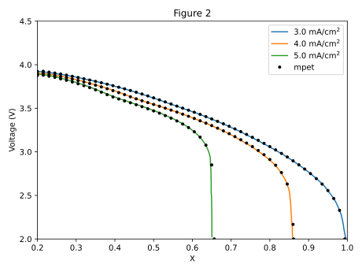
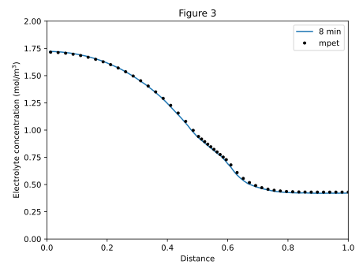
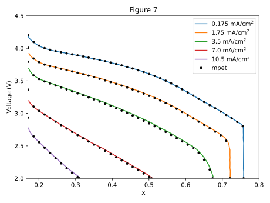
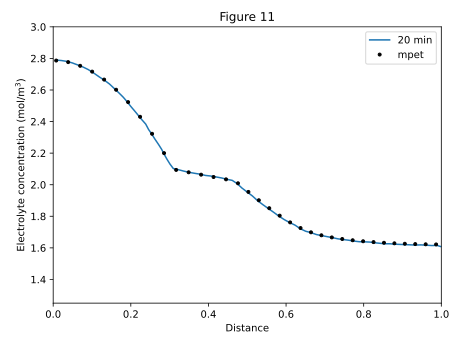
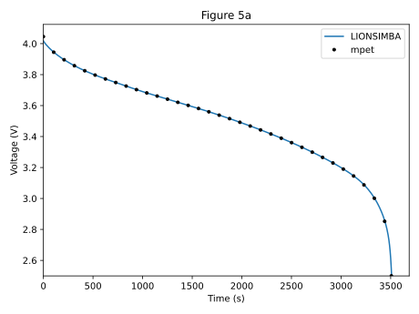
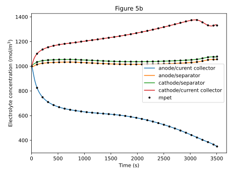
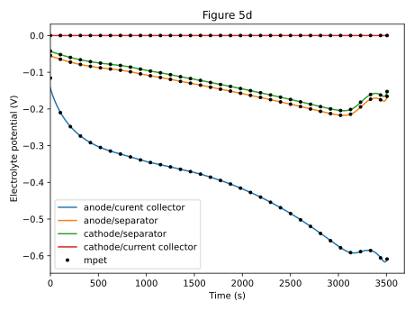
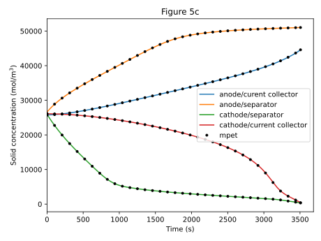

Benchmarks
==========
An important aspect of software development is to check the accuracy of results against accepted standards. To this end, mpet has been benchmarked against the following published results in literature, and the mpet configs for reproducing these results are included in the source code repository.

Fuller, Doyle, Newman (1994)
----------------------------
T. F. Fuller, M. Doyle, and J. Newman, `Simulation and Optimization of the Dual Lithium Ion Insertion Cell <https://iopscience.iop.org/article/10.1149/1.2054684>`_, J. Electrochem. Soc. 141, 1 (1994).

MPET config: `configs/params_system_Fuller94.cfg <https://github.com/TRI-AMDD/mpet/blob/master/configs/params_system_Fuller94.cfg>`_

Doyle (1996)
----------------------------
M. Doyle, J. Newman, A. S. Gozdz, C. N. Schmutz, and J.-M. Tarascon, `Comparison of Modeling Predictions with Experimental Data from Plastic Lithium Ion Cells <https://iopscience.iop.org/article/10.1149/1.1836921>`_, J. Electrochem. Soc. 143, 1890 (1996).

MPET config: `configs/params_system_Doyle96-cell1.cfg <https://github.com/TRI-AMDD/mpet/blob/master/configs/params_system_Doyle96-cell1.cfg>`_

LIONSIMBA (2016)
----------------------------
M. Torchio, L. Magni, R. B. Gopaluni, R. D. Braatz, and D. M. Raimondo, `LIONSIMBA: A Matlab Framework Based on a Finite Volume Model Suitable for Li-Ion Battery Design, Simulation, and Control <https://iopscience.iop.org/article/10.1149/2.0291607jes>`_, J. Electrochem. Soc. 163, A1192 (2016).

MPET config: `configs/params_system_LIONSIMBA.cfg <https://github.com/TRI-AMDD/mpet/blob/master/configs/params_system_LIONSIMBA.cfg>`_ 

